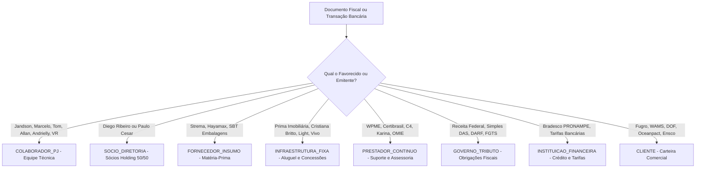

# Inteligência de Classificação e Governança de Parceiros de Negócio (Eco-Mitang)

Na holding Eco-Mitang (**Mitang Brasil Comércio e Serviços LTDA** e **Arandu Comércio e Serviços LTDA**), a distinção rigorosa entre quem compra, quem produz, quem trabalha e quem governa a empresa é mandatória. Colaboradores PJ **NUNCA** devem ser tratados como fornecedores comuns, e sócios nunca devem ser confundidos com prestadores ou clientes.

---

## 1. As 8 Categorias Oficiais de Parceiros no ERP Eco-Mitang

| Tipo de Entidade (`tipo_entidade`) | Descrição e Papel no Ecossistema | Exemplos Reais Mapeados | Impacto Contábil / Financeiro |
| :--- | :--- | :--- | :--- |
| **`CLIENTE`** | Empresas e órgãos públicos que compram baterias, alugam oceanografia ou contratam serviços offshore. | Fugro, WAMS, DOF Subsea, Oceanpact, Ensco, CLS, UFPA/CNPq. | Receita Operacional Bruta, Contas a Receber, Margem de Contribuição. |
| **`COLABORADOR_PJ`** | Equipe técnica e operacional contratada como PJ. Faz parte da folha de pagamento mensal recorrente, tem acesso ao ERP e recebe benefícios (VR). | Jandson Pereira, Marcelo Ferreira, Tom Alves, Allan Lourenço, Andrielly Britto, VR Benefícios. | Despesa com Pessoal / Folha Operacional, Custo Fixo Recorrente de Runway. |
| **`SOCIO_DIRETORIA`** | Sócios-fundadores e conselho gestor da holding com rateio 50% / 50% entre Diego Ribeiro e Paulo Cesar. | Diego Ribeiro, Paulo Cesar do Rego, Regina F. | **Retiradas:** Pró-Labore (mensal) ou Dividendos (isenção fiscal).<br>**Entradas:** Aporte / Mútuo de Capital (não gera tributo). |
| **`FORNECEDOR_INSUMO`** | Indústrias e distribuidoras que fornecem matéria-prima, células de lítio, cases estancos e componentes de baterias submarinas. | Strema Indústria, Hayamax Distribuidora, SBT Embalagens, BRF (Cestas). | Custo das Mercadorias Vendidas (CMV), Compras Parceladas no Contas a Pagar. |
| **`PRESTADOR_CONTINUO`** | Empresas terceirizadas que prestam serviços administrativos, contábeis, jurídicos, licenças de software e suporte operacional. | WPME Contabilidade, Certibrasil, C4 Treinamentos, Karina dos Santos, OMIE, Hostgator, SulAmérica. | Despesas Administrativas e Operacionais Contínuas (OPEX). |
| **`INFRAESTRUTURA_FIXA`** | Locadores das sedes operacionais e concessionárias de serviços públicos essenciais. | Prima Imobiliária (Salas 206/207), Cristiana Britto (Sala 216), Light (Energia), Vivo, Claro. | Despesa Fixa Imobiliária & Contas de Consumo (indispensável para operação). |
| **`GOVERNO_TRIBUTO`** | Órgãos arrecadadores tributários e previdenciários nas esferas federal, estadual e municipal. | Receita Federal (Simples Nacional DAS), Receita Federal / INSS (DARF), CEF (FGTS). | Impostos sobre Faturamento e Encargos Sociais. Vencem no dia 20 de cada mês. |
| **`INSTITUICAO_FINANCEIRA`** | Bancos comerciais e agentes de crédito de amortização de capital de giro. | Banco Bradesco (PRONAMPE em 42 parcelas), Banco Itaú Unibanco. | Despesas Financeiras, Amortização de Dívida de Curto e Longo Prazo. |

---

## 2. Regras Estritas de Classificação para a IA

### 2.1. Colaborador PJ $\neq$ Fornecedor Insumo
- **Erro a Evitar:** Lançar a remuneração mensal de Jandson Pereira ou Marcelo Ferreira como "Compra de Fornecedor".
- **Comportamento Esperado:**
  1. O Colaborador PJ emite NFS-e de serviços mensais contra a Mitang ou Arandu.
  2. O valor é fixo ou indexado por horas/diárias de embarque.
  3. Está atrelado ao benefício alimentação (VR Benefícios de R$ 800/pessoa).
  4. Deve constar na aba `Colaboradores PJ` do CRM e na linha `Folha de Pessoal & Colaboradores PJ` de Contas a Pagar.

### 2.2. Distinção de Fluxos de Sócios (Diego Ribeiro & Paulo Cesar)
- **Aporte de Capital / Mútuo:**
  - Ocorre quando o sócio transfere recursos de sua conta pessoal física para a empresa para cobrir descasamento momentâneo de caixa.
  - **Classificação:** `SOCIOS_APORTE`. Não incide Simples Nacional nem IRPJ.
- **Pró-Labore:**
  - Remuneração mensal pelo trabalho de administração e comercial técnico.
  - **Classificação:** `SOCIOS_PRO_LABORE`. Sujeito a recolhimento de INSS e IRPF.
- **Distribuição de Lucros / Dividendos:**
  - Retirada de sobras de caixa apuradas contabilmente com base no DRE ou venda de ativos.
  - **Classificação:** `SOCIOS_DIVIDENDOS`. Isento de tributação para os sócios.

### 2.3. Rateio 50% / 50% entre Sócios
Na holding Eco-Mitang, os compromissos contratuais e custos operacionais da sede compartilhada possuem rateio padrão de 50% para Diego Ribeiro e 50% para Paulo Cesar. No cadastro de obrigações de Contas a Pagar, o objeto `rateio_socios` deve refletir:
```json
{
  "percentual_diego": 50,
  "percentual_paulo": 50,
  "valor_diego": 400.00,
  "valor_paulo": 400.00
}
```

---

## 3. Diagrama do Motor de Identificação e Segmentação



---

## 4. Diretrizes de Interface e Acesso no Frontend

1. **Abas Dedicadas no CRM & SRM 360°**:
   - `[ Clientes ]` (Carteira Comercial)
   - `[ Colaboradores PJ ]` (Equipe Técnica & Operacional)
   - `[ Sócios & Diretoria ]` (Diego Ribeiro & Paulo Cesar)
   - `[ Fornecedores Insumos ]` (BOM & Matéria-Prima)
   - `[ Prestadores & Infra ]` (Contabilidade, Locação, Softwares)
   - `[ Governo & Bancos ]` (Receita Federal, PRONAMPE)
2. **Badges de Alta Legibilidade**:
   - `COLABORADOR_PJ`: Ciano (`bg-cyan-500/20 text-cyan-300`)
   - `SOCIO_DIRETORIA`: Roxo (`bg-purple-500/20 text-purple-300`)
   - `FORNECEDOR_INSUMO`: Âmbar (`bg-amber-500/20 text-amber-300`)
   - `PRESTADOR_CONTINUO`: Esmeralda (`bg-emerald-500/20 text-emerald-300`)
   - `INFRAESTRUTURA_FIXA`: Azul (`bg-blue-500/20 text-blue-300`)
   - `GOVERNO_TRIBUTO`: Vermelho/Rosa (`bg-rose-500/20 text-rose-300`)
   - `INSTITUICAO_FINANCEIRA`: Índigo (`bg-indigo-500/20 text-indigo-300`)
