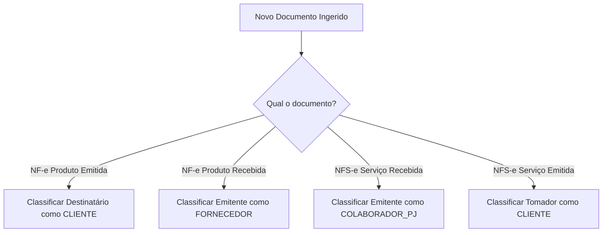

# Inteligência de Classificação de Parceiros de Negócio (Eco-Mitang)

Na holding Eco-Mitang (Mitang Brasil Comércio e Serviços LTDA e Arandu Comércio e Serviços LTDA), **NUNCA** se deve misturar parceiros que compram com parceiros que vendem ou prestam serviços. A correta classificação é mandatória para a integridade contábil, fiscal e comercial.

---

## 1. As 3 Categorias Fundamentais de Parceiros

### 1.1. CLIENTE (`tipo_entidade = 'CLIENTE'`)

- **Definição**: Empresas e instituições que compram packs de baterias, alugam equipamentos oceanográficos ou contratam serviços offshore da holding.
- **Origem dos Dados**:
  - Destinatários em **NF-e emitidas** (`direcao = 'EMITIDA'`).
  - Tomadores em **NFS-e emitidas**.
  - Clientes da carteira corporativa (ex: Oceanpact, Fugro, Ensco, C-Innovation, DTA Engenharia).
  - Base de cotações em `orcamentos_historico`.
- **Regra de Negócio**:
  - Devem ser monitorados por Capital Social, Quadro Societário (QSA), bloqueios fiscais e limites de crédito.

### 1.2. FORNECEDOR INDUSTRIAL (`tipo_entidade = 'FORNECEDOR'`)

- **Definição**: Empresas que vendem insumos, matérias-primas, componentes eletrônicos, células de lítio, conectores subaquáticos e embalagens para a montagem de baterias.
- **Origem dos Dados**:
  - Emitentes em **NF-e recebidas** (`direcao = 'RECEBIDA'` e `tipo_documento = 'NFE_PRODUTO'`).
  - Exemplos reais no ERP: **Strema Indústria** (cases e componentes), **SBT Embalagens**, **Hayamax**, **Ryndack**.
- **Regra de Negócio**:
  - Seus valores alimentam diretamente o **Custo das Mercadorias Vendidas (CMV)** na DRE e o módulo de **Contas a Pagar**.

### 1.3. COLABORADOR PJ / PRESTADOR DE SERVIÇO (`tipo_entidade = 'COLABORADOR_PJ'`)

- **Definição**: Pessoas jurídicas e profissionais liberais que prestam serviços técnicos contínuos ou eventuais para a holding (engenharia clínica, consultoria ambiental, suporte offshore, contabilidade, jurídica, TI).
- **Origem dos Dados**:
  - Emitentes em **NFS-e recebidas** (`direcao = 'RECEBIDA'` e `tipo_documento = 'NFSE_SERVICO'`).
- **Regra de Negócio**:
  - Seus valores alimentam as **Despesas Operacionais com Terceiros** na DRE.
  - Nunca devem ser contabilizados como despesa de compras de mercadorias.

---

## 2. Algoritmo de Decisão para a IA

Ao ingerir um novo documento fiscal eletrônico (XML) ou lançamento bancário (OFX):

---

## 3. Diretrizes de Apresentação no Frontend

1. **Abas Exclusivas**: As telas de CRM e Gestão de Contatos devem conter abas separadas para:
   - `[ Clientes (Quem Compra) ]`
   - `[ Fornecedores Industriais ]`
   - `[ Colaboradores PJ / Prestadores ]`
2. **Badges de Identificação**: Cada registro deve ter uma tag colorida indicando sua classe (Ciano para Clientes, Âmbar para Fornecedores, Roxo para Colaboradores).
3. **Contagem Precisa**: Os KPIs de clientes corporativos nunca devem incluir fornecedores ou prestadores na sua soma.
