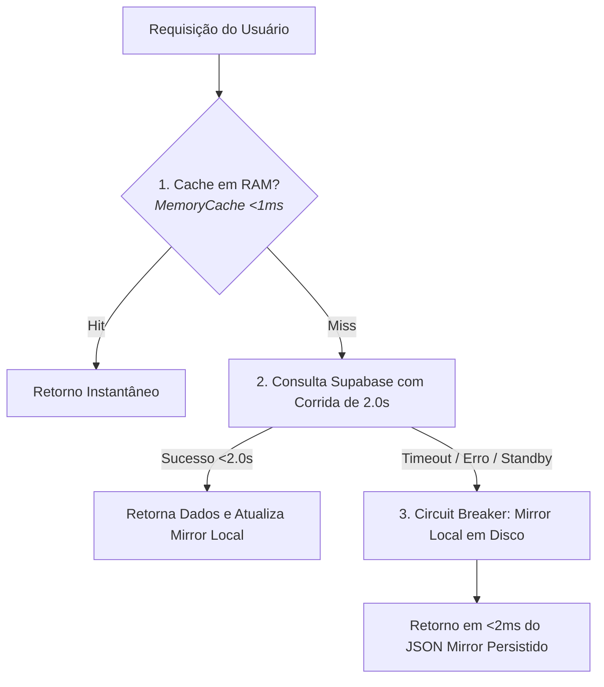

# Alta Disponibilidade e Resiliência de Banco de Dados: Local Mirror

Este guia orienta engenheiros e agentes de IA sobre como manter o ERP Eco-Mitang 100% funcional, eliminando telas em branco e indisponibilidades causadas por restrições do plano gratuito do Supabase (pausas automáticas, esgotamento do pool de conexões e latências de rede na nuvem AWS).

---

## 1. O Problema da Nuvem Free Tier

Projetos hospedados no plano Free do Supabase / AWS enfrentam 3 riscos operacionais críticos:
1. **Sleep / Pausa por Inatividade**: O banco entra em hibernação após períodos de ociosidade, levando de 10 a 30 segundos para acordar, causando `Connection terminated due to connection timeout`.
2. **Pool Exhaustion**: Limite rígido de 15 a 20 conexões simultâneas. Múltiplos workers ou requisições concorrentes rejeitam conexões com `too many connections`.
3. **Flutuações de DNS**: Redes corporativas e roteadores locais frequentemente falham na resolução do hostname `aws-0-sa-east-1.pooler.supabase.com`.

---

## 2. A Solução: Arquitetura de 3 Camadas com Circuit Breaker



### Componentes da Arquitetura:

1. **Camada 1 (RAM Cache - `memoryCache`)**:
   - Respostas de leitura rápida são armazenadas em memória RAM com TTL de 30 a 300 segundos.
   - Tempo de resposta: `< 1ms`.

2. **Camada 2 (Supabase Pool com IP Direto e Keep-Alive)**:
   - Utiliza conexão pooler com IP verificado na AWS (`15.229.150.166`) para contornar falhas de DNS no Windows.
   - `connectionTimeoutMillis: 30000` (tolerância elástica para o acordar do container).
   - `idleTimeoutMillis: 30000` com `keepAlive: true`.

3. **Camada 3 (Mirror Local em Disco - `database/local_mirror/`)**:
   - Espelhos persistidos em formato JSON estruturado das tabelas mestres:
     * `clientes.json`
     * `catalogo_universal.json`
     * `orcamentos_historico.json`
     * `transacoes_bancarias.json`
     * `notas_fiscais.json`
   - O `LocalMirrorService.executeWithFallback(key, queryFn)` executa uma corrida: se o Supabase responder em até 2 segundos, os dados são entregues e o mirror é atualizado. Se o Supabase demorar ou falhar, o serviço entrega os dados locais em `< 2ms`.
   - **Resultado**: O usuário JAMAIS perde a visualização de clientes, baterias ou fluxo de caixa.

---

## 3. Comandos de Manutenção do Mirror Local

- Para forçar a sincronização de todas as tabelas mestres do banco para o disco:
  ```bash
  node scripts/sync_local_mirror.js
  ```
- O serviço sincroniza silenciosamente em background a cada ciclo de escrita bem-sucedido.
