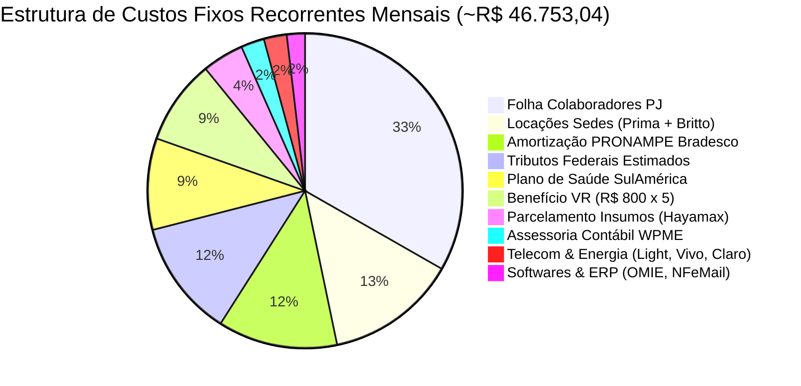

# Engenharia de Contas a Pagar, Obrigações Recorrentes e Projeção de Runway (Eco-Mitang)

Na gestão financeira e de tesouraria de uma holding industrial e de serviços submarinos como a **Eco-Mitang**, a previsibilidade do fluxo de caixa futuro é a espinha dorsal da sobrevivência operacional.

---

## 1. Princípio Fundamental: Extrato Bancário vs Compromissos Futuros

A IA **NUNCA** deve tentar projetar pagamentos futuros olhando apenas para o extrato bancário de lançamentos passados:
1. **Extratos Bancários (OFX)**: Registram fatos contábeis **passados e já liquidados**.
   - Mostram o que já saiu ou entrou na conta corrente.
   - Contêm ruídos bancários diários como aplicações automáticas de CDI overnight (`APLIC AUT MAIS` / `INVEST FACIL`).
2. **Contas a Pagar & Obrigações Futuras**: Nascem dos **compromissos contratuais e do calendário fiscal**:
   - Contratos de locação das sedes operacionais.
   - Contratos de remuneração de colaboradores PJ e benefícios acordados.
   - Contratos bancários de amortização de empréstimos (PRONAMPE em 42 parcelas).
   - Compras parceladas de insumos industriais (Boleto/PIX de Strema e Hayamax).
   - Calendário tributário da Receita Federal (Simples Nacional DAS, DARF INSS e FGTS com vencimento todo dia 20).

---

## 2. A Estrutura Real de Custos Fixos Recorrentes da Eco-Mitang

A análise dos lançamentos corporativos da holding consolidou a seguinte estrutura mensal de saídas fixas:

### 2.1. Detalhamento dos Grupos de Despesa

1. **Equipe Técnica & Folha de Pagamento PJ (~R$ 15.265,82/mês)**:
   - Marcelo Ferreira: R$ 3.740,00
   - Jandson Pereira de Oliveira: R$ 1.525,82 (base fixa) + horas técnicas
   - Tom Alves: R$ 7.500,00 (consultoria especializada em subsea)
   - Andrielly Britto: Suporte operacional
   - Allan Lourenço: Remuneração técnica / rescisão em agosto/2026
2. **Benefícios aos Colaboradores (~R$ 8.314,51/mês)**:
   - Vale Alimentação (VR Benefícios): R$ 800,00 por colaborador todo mês.
   - Assistência Médica Corporativa: SulAmérica Saúde (R$ 4.314,51).
   - Previdência e Seguros: Bradesco Vida e Previdência (R$ 122,59).
3. **Infraestrutura Imobiliária & Sedes Operacionais (R$ 6.184,73/mês)**:
   - Sede Mitang Brasil: Salas 206 e 207 via Prima Imobiliária (R$ 4.062,40/mês).
   - Sede Arandu: Sala 216 via Cristiana Garcia De Britto (R$ 2.122,33/mês).
4. **Contrato de Empréstimo PRONAMPE Bradesco (~R$ 5.638,21/mês)**:
   - Linha de capital de giro contratada em **42 parcelas**.
   - Em agosto/2026 estava na amortização da parcela 26 de 42.
   - Saldo devedor remanescente em amortização até o final do contrato.
5. **Assessoria Contábil WPME (R$ 1.100,00/mês)**:
   - Mitang Brasil: R$ 600,00/mês.
   - Arandu: R$ 500,00/mês.
6. **Contas de Consumo & Softwares (~R$ 1.938,00/mês)**:
   - Light Serviços de Eletricidade (energia das sedes operacionais).
   - Vivo Fibra + Claro Móvel (telefonia corporativa e internet).
   - Licença ERP OMIE + NFeMail + Hostgator (hospedagem e domínios).
7. **Compras Parceladas de Fornecedores de Insumo**:
   - Hayamax Distribuidora: R$ 1.959,32/mês até dezembro de 2026.
   - Strema Indústria: Parcelas contratuais dos lotes de cases submarinos e conectores.
   - BRF S.A.: Cestas de Natal em parcelamento programado (R$ 450,00/mês).

---

## 3. Algoritmo de Projeção de Runway (30, 60, 90 e 120 Dias)

Ao calcular a previsibilidade futura de caixa para a diretoria, a IA deve cruzar:
1. **Entradas Previstas Auditadas**:
   - Faturas emitidas ou pedidos de compra (PO) com status `À Vencer` em `orcamentos_historico`.
   - Exemplo: WAMS (R$ 275.984,00), Fugro (R$ 190.904,00), CLS (R$ 4.125,00), UFPA/CNPq (R$ 2.372,70).
2. **Saídas Contratuais Fixas**:
   - Custo Fixo Operacional Mensal consolidado (~R$ 46.753,04) + compras programadas de insumos.
3. **Fórmula do Saldo Projetado por Mês**:
   $$\text{Saldo Projetado}_m = \text{Receitas Previstas}_m - \text{Saídas Previstas}_m$$
4. **Cálculo de Runway (Meses de Cobertura)**:
   $$\text{Runway (meses)} = \frac{\text{Saldo em Caixa Atual} + \text{Recebíveis Confirmados}}{\text{Custo Fixo Operacional Mensal}}$$

### 3.1. Classificação de Risco de Runway
- **Runway $\ge 6$ meses**: `SUPERAVIT_CONFORTAVEL` (Verde Esmeralda). Operação sólida e com capacidade de investimento.
- **Runway de 3 a 5 meses**: `EQUILIBRADO` (Ciano / Azul). Posição normal de capital de giro.
- **Runway de 1 a 2 meses**: `ALERTA_CAPITAL_DE_GIRO` (Âmbar). Requer antecipação de faturas ou aceleração de cobrança.
- **Runway $< 1$ mês**: `CRITICO` (Vermelho). Risco iminente de descasamento; requer aporte de mútuo dos sócios ou renegociação de prazos de fornecedores.

---

## 4. Diretrizes de Apresentação e Interação na UI

1. **Aba "Contas a Pagar & Recorrências"**:
   - Renders 4 synthesis cards: Total a Pagar, Folha Colaboradores PJ, Insumos Matéria-Prima, PRONAMPE.
   - Filtros dinâmicos por Status (`TODAS`, `A_PAGAR`, `PAGO`, `EM_ATRASO`, `PROGRAMADO`) e Tipo de Entidade (`COLABORADOR_PJ`, `SOCIO_DIRETORIA`, `FORNECEDOR_INSUMO`, etc.).
   - Exibe a coluna de Rateio Sócios (`50% DR / 50% PC` ou `100% Mitang`).
   - Totalizador no rodapé (`tfoot`) calculando em tempo real o subtotal dos registros visíveis.
2. **Aba "Projeção Futura (30 a 120d)"**:
   - Banner executivo com taxa de cobertura e aviso de superávit.
   - Grade dos 4 meses futuros projetados (Setembro a Dezembro de 2026).
   - Decomposição visual dos custos fixos mensais versus faturas auditadas a receber da carteira de clientes.
