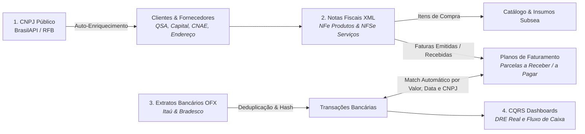

# Ecossistema Financeiro Unificado: Do CNPJ à Conciliação Bancária

Este guia descreve a espinha dorsal do ERP Eco-Mitang, demonstrando como os documentos reais da empresa (**Consultas de CNPJ**, **XMLs de NF-e/NFS-e** e **Extratos Bancários OFX**) se integram em um fluxo contínuo e automatizado.

---

## 1. O Ciclo Integrado de Ponta a Ponta

---

## 2. As 4 Etapas do Ciclo Operacional

### Etapa 1: Ingestão e Inteligência de CNPJ
- O operador informa o CNPJ do cliente ou fornecedor (ou o sistema detecta um CNPJ novo em um extrato/nota).
- O sistema busca os dados governamentais completos e preenche a tabela `clientes`, preservando o JSON bruto em `dados_receita_brutos` e inferindo a vertical de mercado pelo CNAE.
- Se a empresa estiver inapta, ativa o bloqueio fiscal preventivo.

### Etapa 2: Faturamento e Compras via XML (NF-e e NFS-e)
- **Venda de Baterias e Locações (Notas Emitidas)**:
  * A NF-e/NFS-e gerada pelo faturamento alimenta a tabela `notas_fiscais`.
  * As duplicatas são transformadas em `parcelas_recebimento`.
- **Compra de Matéria-Prima (Notas Recebidas de Fornecedores)**:
  * O XML enviado por fornecedores (como a Strema) é importado no ERP.
  * Os itens alimentam o estoque de insumos e as faturas viram contas a pagar programadas.

### Etapa 3: Ingestão e Blindagem Anti-Duplicação de Extratos Bancários OFX
- **Desafio do Internet Banking Bradesco**: O Internet Banking do Bradesco anexa os lançamentos pendentes do dia do download (ex: `26/08/2026`) no final de todos os arquivos mensais passados, gerando FITIDs dinâmicos (`N102DF`, `N1048B`, etc.).
- **Regra de Deduplicação Mandatória**: A chave de unicidade de transações bancárias NÃO pode depender exclusivamente do `FITID`. A unicidade deve ser garantida pela tupla de negócio:
  `SHA-256(banco_codigo + conta_numero + data_lancamento + valor + memo_sanitizado)`.
- **Segregação de Saldos Informativos Diários**: Linhas informativas inseridas diariamente pelos bancos (`SALDO TOTAL DISPONÍVEL DIA`, `SALDO MOVIMENTAÇÃO CONTA`, `SALDO APLIC. AUT.`, `SDO ANTERIOR`) recebem obrigatoriamente `is_saldo_informativo = TRUE` e são EXCLUÍDAS do cálculo do fluxo de caixa operacional, evitando inflar artificialmente as entradas e saídas.
- **Tratamento de Encoding (Anti-Mojibake)**: Extratos bancários exportados em Latin1 / Windows-1252 devem ser decodificados com sanitização rigorosa para UTF-8 puro, eliminando caracteres corrompidos como `ÇÃO`.

### Etapa 4: Conciliação Bancária Automática
- O extrator lê o `<MEMO>` da transação bancária.
- Ao encontrar um CNPJ correspondente a um cliente ou fornecedor, vincula a movimentação à respectiva entidade.
- Compara o valor do crédito com as parcelas pendentes daquele cliente:
  * Se houver correspondência exata de valor, **baixa a parcela automaticamente** (`status_pagamento = 'PAGO'`).
  * Atualiza o saldo real da conta bancária e alimenta a projeção dos Dashboards CQRS.

---

## 3. Padrão Nacional de Formatação (Brasil)

Em conformidade estrita com as normas da holding Eco-Mitang:
- **Datas**: Obrigatoriamente `DD/MM/AAAA` (ex: `26/08/2026`) e `DD/MM/AAAA HH:mm:ss`. Jamais utilizar `AAAA-MM-DD` na camada de visualização do usuário.
- **Moeda**: `R$ 1.234,56` (ponto separador de milhar e vírgula separadora de centavos).
- **CNPJ**: `XX.XXX.XXX/XXXX-XX`.
