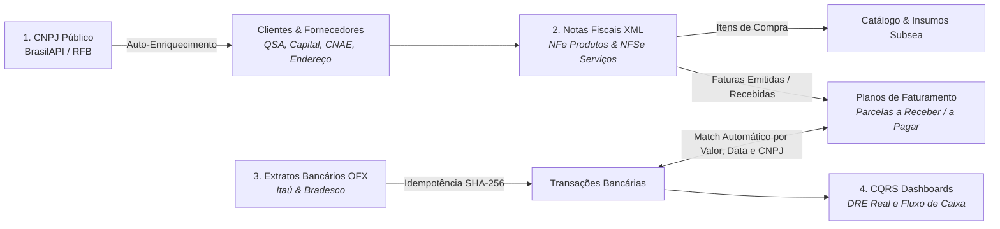

# Ecossistema Financeiro Unificado: Do CNPJ à Conciliação Bancária

Este guia descreve a espinha dorsal do ERP Eco-Mitang, demonstrando como os documentos reais da empresa (**Consultas de CNPJ**, **XMLs de NF-e/NFS-e** e **Extratos Bancários OFX**) se integram em um fluxo contínuo e automatizado.

---

## 1. O Ciclo Integrado de Ponta a Ponta

---

## 2. As 4 Etapas do Ciclo Operacional

### Etapa 1: Ingestão e Inteligência de CNPJ
- O operador informa o CNPJ do cliente ou fornecedor.
- O sistema busca os dados governamentais completos e preenche a tabela `clientes`, preservando o JSON bruto em `dados_receita_brutos`.
- Se a empresa estiver inapta, ativa o bloqueio fiscal preventivo.

### Etapa 2: Faturamento e Compras via XML (NF-e e NFS-e)
- **Venda de Baterias e Locações (Notas Emitidas)**:
  * A NF-e/NFS-e gerada pelo faturamento alimenta a tabela `notas_fiscais`.
  * As duplicatas são transformadas em `parcelas_recebimento`.
- **Compra de Matéria-Prima (Notas Recebidas de Fornecedores)**:
  * O XML enviado por fornecedores (como a Strema) é importado no ERP.
  * Os itens alimentam o estoque de insumos e as faturas viram contas a pagar programadas.

### Etapa 3: Ingestão de Extratos Bancários OFX
- Os extratos mensais do Itaú e Bradesco são importados sem intervenção manual.
- **Deduplicação Garantida**: Chave criptográfica `idempotency_hash` descarta 100% das transações já existentes sem erro de lote.
- **Filtro de Varreduras**: Linhas de saldo e aplicações automáticas diárias são segregadas, evitando faturamentos ilusórios.

### Etapa 4: Conciliação Bancária Automática
- O extrator lê o `<MEMO>` da transação bancária.
- Ao encontrar um CNPJ correspondente a um cliente ou fornecedor, vincula a movimentação à respectiva entidade.
- Compara o valor do crédito com as parcelas pendentes daquele cliente:
  * Se houver correspondência exata de valor, **baixa a parcela automaticamente** (`status_pagamento = 'PAGO'`).
  * Atualiza o saldo real da conta bancária e alimenta a projeção dos Dashboards CQRS.
