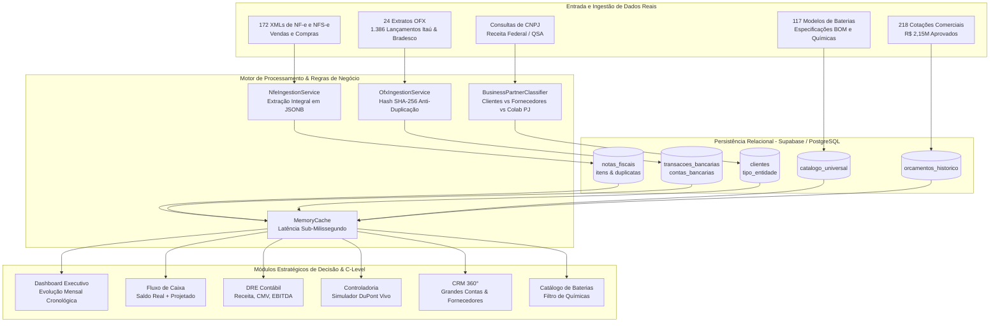
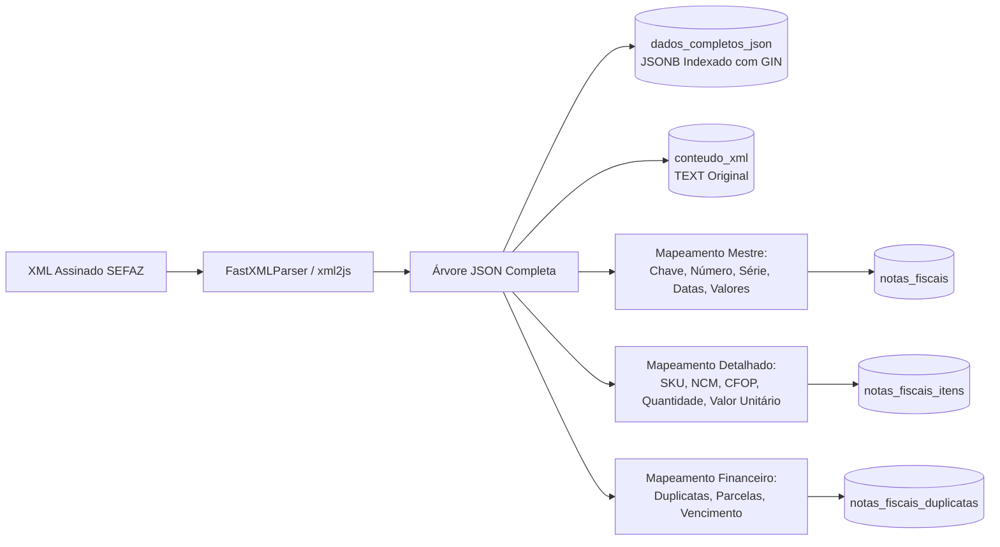
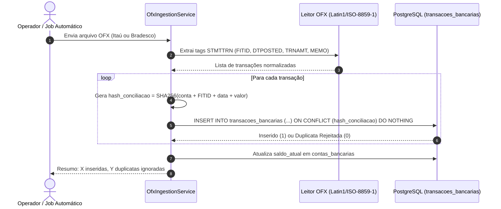
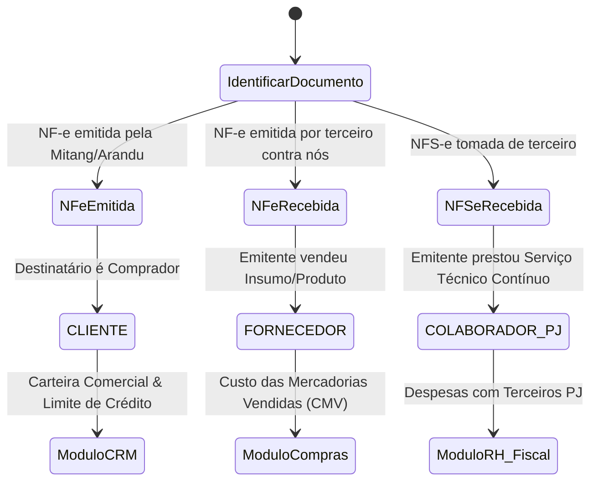
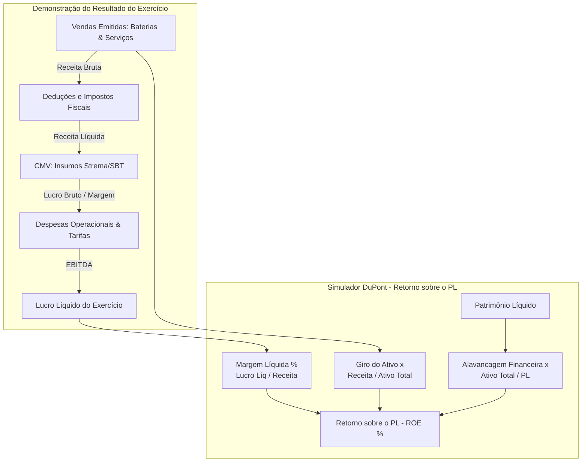
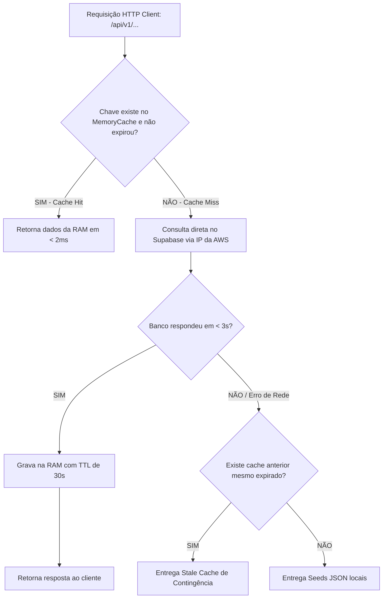
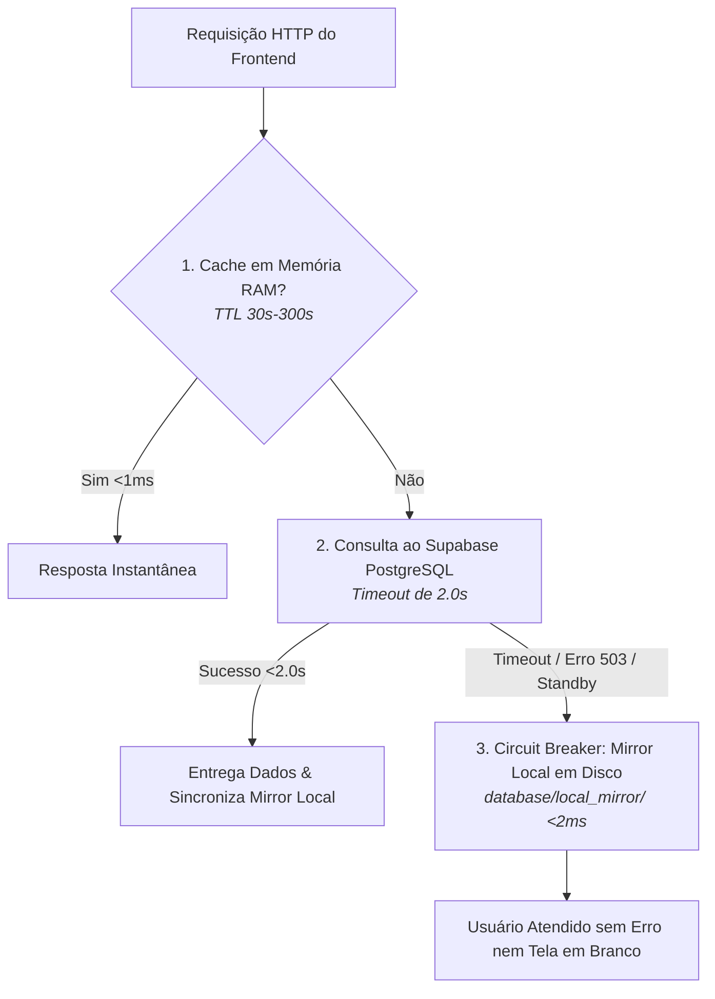

# Arquitetura e Fluxo de Trabalho do Sistema (Eco-Mitang ERP)

> **Documento Mestre para Desenvolvedores e Agentes de Inteligência Artificial (Antigravity, Cursor, Claude, OpenAI, Gemini)**  
> **Última Atualização:** 27 de Agosto de 2026  
> **Status:** Em Produção / Carga 100% Real Ativa  

---

## 1. Visão Geral da Holding Eco-Mitang

O ERP Eco-Mitang é uma plataforma empresarial multi-tenant desenvolvida para atender às demandas de engenharia, manufatura e operações submarinas da holding composta por 4 CNPJs:

1. **Mitang Brasil Comércio e Serviços LTDA** (CNPJ `44.221.348/0001-84`):
   - Especializada na engenharia e fornecimento de packs de baterias de alta densidade (Li-SOCL2, Alcalina, Ni-MH, Li-Ion) para equipamentos oceanográficos, robótica submarina (ROVs/AUVs) e área hospitalar.
2. **Arandu Comércio e Serviços LTDA** (CNPJ `61.349.982/0001-16`):
   - Braço comercial e técnico de baterias, soluções de energia e contratos corporativos offshore.
3. **Mitang Rental** (Locação e Metrologia DimCon):
   - Locação de transponders acústicos, medidores de corrente ADCP e sistemas de metrologia dimensional subsea.
4. **Mitang Academy** (Treinamentos Marítimos):
   - Capacitação técnica e cursos de operações offshore.

---

## 2. Diagramas de Fluxo de Trabalho (Workflows Mermaid)

### 2.1. Fluxograma Global do Ecossistema Integrado

O diagrama abaixo ilustra como os dados reais fluem entre os módulos do ERP:



---

### 2.2. Fluxo do Motor Fiscal Sem Perdas (NF-e & NFS-e)

Garante que nenhuma tag de imposto, item ou fatura seja descartada durante o processamento de notas:



---

### 2.3. Fluxo de Conciliação Bancária OFX com Idempotência Absoluta

Previne que arquivos bancários importados repetidamente gerem lançamentos duplicados:



---

### 2.4. Classificação Rigorosa de Parceiros de Negócio

Separação obrigatória para evitar contabilidade distorcida:



---

### 2.5. Arquitetura da DRE e Modelo de Análise DuPont

Demonstra a relação de causa e efeito entre vendas, compras de insumos e retorno ao acionista:



---

### 2.6. Camada de Cache em Memória com Fallback Instantâneo

Como a arquitetura alcança latência de **1.0ms a 4ms**:



---

## 3. Guia de Continuidade para Novas Ferramentas de IA e Desenvolvedores

Ao assumir o desenvolvimento deste repositório em qualquer IDE ou agente:

1. **Regras de Negócio Multi-Tenant**:
   - Sempre utilize o cabeçalho `x-empresa-id` nas chamadas de API.
   - Quando o valor for `all`, agregue as informações para consolidado da holding.
   - IDs Oficiais:
     * **Mitang Brasil**: `29ea0857-7cf7-44e1-ba36-a3f323c4670c`
     * **Arandu**: `0754c882-d528-4d34-8c96-6d9af7e8d322`
2. **Parceiros de Negócio**:
   - Ao criar novos endpoints de clientes, sempre filtre ou identifique `tipo_entidade` (`CLIENTE`, `FORNECEDOR`, `COLABORADOR_PJ`). Nunca misture na contagem de carteira.
3. **Catálogo de Baterias**:
   - Os modelos únicos de baterias somam 117 itens no catálogo base. Ao paginar, utilize limites de até 500 itens (`limit=500`).
4. **Performance**:
   - Utilize a classe `memoryCache` localizada em `src/core/cache/memory-cache.ts` para qualquer novo endpoint de leitura intensiva.
5. **Design System**:
   - Mantenha o padrão de **abas segmentadas** ("menos é mais") com a função global `window.switchTab(moduleName, tabId)`.
   - Evite acumular gráficos ou tabelas pesadas sem segmentação por abas na mesma viewport.

---

### 2.6. Arquitetura de Alta Disponibilidade (Mirror Local Resistente a Quedas)

Para anular qualquer impacto de instabilidade, pausas de inatividade ou limites de conexões do plano Free do Supabase / AWS, o ERP Eco-Mitang implementa uma camada híbrida de alta disponibilidade com espelho em disco:



### 2.7. Motor de Enriquecimento e Dossiê 360° de Parceiros

Ao clicar em qualquer linha de cliente, fornecedor ou colaborador PJ:
1. O backend busca os dados públicos da Receita Federal armazenados em `dados_receita_brutos`.
2. A IA infere automaticamente a **Vertical / Nicho de Mercado** a partir do CNAE:
   - **Offshore, Petróleo & Gás Subsea** (CNAEs `06`, `09`, `7112000`, ou termos como Petrobras, Fugro, Oceanpact).
   - **Hospitalar & Equipamentos Médicos** (CNAEs `86`, `4773`, `3250`, ex: MV3 Hospitalar).
   - **Indústria & Insumos Manufaturados** (CNAEs `22`, `17`, `27`, ex: Strema, SBT Embalagens).
   - **Serviços Técnicos & Consultoria PJ** (CNAEs `71`, `70`, `69`, `62`).
   - **Comércio & Distribuição Geral** (CNAEs `46`, `47`).
3. O modal **Dossiê 360°** consolida dados cadastrais, QSA com faixa etária, histórico de notas fiscais, propostas comerciais, ranking de baterias negociadas e extrato bancário de pagamentos.

### 2.8. Blindagem Anti-Duplicação de Internet Banking

- **Problema do Bradesco**: O Internet Banking do Bradesco anexa os lançamentos do dia corrente ao final de extratos mensais passados, gerando FITIDs dinâmicos (`N102DF`, `N1048B`).
- **Solução Mandatória**: Deduplicação pela chave de negócio `SHA-256(banco + conta + data + valor + memo_sanitizado)`.
- **Segregação de Saldos Informativos**: Transações com memos de saldo diário (`SALDO MOVIMENTAÇÃO CONTA`, `SALDO TOTAL DISPONÍVEL`) recebem `is_saldo_informativo = TRUE` e são excluídas do fluxo de caixa operacional.

### 2.9. Padronização Nacional Estrita de Datas (Brasil)

- **Regra do Sistema**: Todas as datas exibidas na interface do usuário são estritamente formatadas em `DD/MM/AAAA` (ex: `26/08/2026`) ou `DD/MM/AAAA HH:mm:ss`. O formato `AAAA-MM-DD` é restrito à persistência interna do banco de dados.

### 2.10. Inteligência de Dashboard Executivo (MoM, Runway, Curva ABC e Custódia)

O **Centro de Inteligência Executiva** implementa um cockpit estratégico C-Level com 7 pilares fundamentais:

1. **Indicadores de Tendência MoM (Month-over-Month)**:
   - Mede a taxa percentual de crescimento ou desaceleração em relação ao mês anterior ($\Delta\%$).
   - Cores semânticas inteligentes: aumento de faturamento/recebimento é verde (`▲ +X%`), aumento de inadimplência/despesas em atraso é vermelho (`▲ +X%`), e queda na inadimplência é verde (`▼ -X%`).
2. **Alerta de Fluxo de Caixa & Runway (15 Dias)**:
   $$\text{Saldo Projetado} = \text{Saldo Bancário Atual} + \text{À Receber (15d)} - \text{À Pagar (15d)}$$
   - Se positivo: exibe dias de cobertura financeira com badge de `Operação Equilibrada`.
   - Se negativo: aciona alerta pulsante `🚨 ALERTA: NECESSIDADE DE CAPITAL DE GIRO` com o montante exato do déficit.
   - **Modal de Inspecionar 15 Dias**: Decomposição em 4 abas auditáveis:
     * *Contas Bancárias*: Saldo real auditado das 4 contas correntes de Itaú e Bradesco.
     * *À Receber (15d)*: Faturas reais emitidas com previsão de recebimento nos próximos 15 dias.
     * *À Pagar (15d)*: Notas fiscais de matérias-primas e insumos com vencimento na quinzena.
     * *Projeção Diária*: Linha do tempo dia a dia calculando o saldo acumulado final de cada dia.
3. **Curva ABC de Inadimplência (Top 3 Maiores Saldos Vencidos)**:
   - Identifica os 3 parceiros com maiores títulos vencidos, dias médios de atraso e botão direto para o **Dossiê 360°**, viabilizando cobrança executiva ágil.
4. **Cards Detalhados de Despesa**:
   - Alternador dinâmico entre **Receitas** e **Despesas** (`Total Pago`, `A Vencer em 7 Dias`, `A Vencer em 15 Dias`, `Despesas em Atraso`).
5. **Classificação Inteligente de Custódia vs Operacional no OFX**:
   - Mapeia aplicações automáticas do Itaú e Bradesco (`APLICAÇÃO AUTOMÁTICA`, `RESGATE APLIC`, `SDO APLIC`) como `TRANSFERENCIA_CUSTODIA`.
   - Isola o **Saldo Operacional Líquido** das movimentações de custódia e expõe o **Total em Aplicações (Patrimônio Líquido Rendendo)** em destaque na aba Tesouraria.
6. **Gráfico Interativo Adaptativo com Granularidade Dinâmica**:
   - Quando o período filtrado for o ano todo (`Jan/26 a Ago/26` ou $>65$ dias), o gráfico plota os meses consolidados (`JAN`, `FEV`, `MAR`, ..., `AGO`).
   - Quando o usuário seleciona um mês específico (ex: `Mês Atual (Agosto/2026)`, `Mês Anterior (Julho/2026)` ou $\le 65$ dias), o backend fatia o período em **Semanas Reais do Período**:
     * `Sem 1 (01/08 a 07/08)`
     * `Sem 2 (08/08 a 14/08)`
     * `Sem 3 (15/08 a 21/08)`
     * `Sem 4 (22/08 a 28/08)`
     * `Sem 5 (29/08 a 31/08)`
   - O título altera automaticamente para `Evolução Semanal no Período Selecionado`.
7. **Interatividade por Cards**:
   - Os 4 cards principais funcionam como seletores de séries: clicar no card adiciona/remove aquela curva no gráfico sob demanda.

---

### 2.11. Engenharia Avançada do Extrato OFX e Dossiê 360° de Contrapartes

Para máxima legibilidade e usabilidade corporativa, a aba **Tesouraria & OFX** implementa 4 componentes de nível industrial:

```mermaid
flowchart TD
    OFX_RAW[Extrato OFX Bruto] --> REGEX_ACCT[Normalizador Regex de Contas]
    REGEX_ACCT --> COL_BANCO[Coluna 1: Instituição Bancária com Badge Oficial]
    REGEX_ACCT --> COL_CONTA[Coluna 2: Agência e Conta Formatada: Ag. AAAA • CC CCCCC-D]

    OFX_RAW --> CLASSIF[Classificador Financeiro]
    CLASSIF --> PILLS[Barra de Filtros Dinâmicos:<br/>Todas | Entradas | Saídas | Custódia CDI | Rendimentos]
    
    PILLS --> TABELA[Tabela Interativa com Ordenação em Todas as Colunas]
    TABELA --> TFOOT[Linha Fixa de Subtotais Dinâmicos tfoot:<br/>Soma instantânea apenas do que está visível na tela]

    TABELA --> CLICK_MEMO[Clique no Histórico / Memo]
    CLICK_MEMO --> PARSE_NAME[Extrator de Contraparte / Favorecido via Regex]
    PARSE_NAME --> QUERY_HIST[Consulta Histórico Completo em transacoes_bancarias]
    QUERY_HIST --> MODAL_DOSSIE[Modal Dossiê da Contraparte:<br/>Total Pago | Total Recebido | Saldo Líquido | Lançamentos]
```

1. **Colunas de Banco e Agência/Conta Rigorosamente Separadas via Regex**:
   - **Itaú Unibanco**: ACCTIDs de 10 dígitos (ex: `1155995077` $\rightarrow$ `Ag. 1155 • CC 99507-7`, `2927986634` $\rightarrow$ `Ag. 2927 • CC 98663-4`).
   - **Banco Bradesco**: Contas normalizadas com zero à esquerda e dígito (ex: `27414` / `3249` $\rightarrow$ `Ag. 3249 • CC 0027414-3`).
2. **Barra de Filtros e Busca Rápida**:
   - Filtros instantâneos por classificação contábil com contadores em tempo real.
   - Busca em tempo real por descrição, favorecido ou valor.
   - Ordenação clicável nos cabeçalhos: `Data` ($\uparrow \downarrow$), `Histórico / Memo` ($\text{A-Z} \leftrightarrow \text{Z-A}$) e `Valor` ($\uparrow \downarrow$).
3. **Linha Fixa de Subtotais Dinâmicos (`tfoot`)**:
   - Toda tabela possui rodapé somatório que recalcula em tempo real a quantidade de lançamentos visíveis, total de entradas, total de saídas e o saldo líquido do recorte filtrado.
4. **Dossiê Completo da Contraparte / Colaborador PJ**:
   - Clicar sobre o histórico de qualquer transação (ex: `PIX ENVIADO DES: Jandson Pereira de Ol`) abre o **Dossiê Completo de Fluxo Financeiro da Contraparte**, recuperando todas as transferências bancárias, pagamentos e recebimentos daquela pessoa física ou jurídica ao longo de todo o ano, com 4 cards de KPIs e tabela auditada.

---

### 2.12 Arquitetura do Ciclo de Vida de Orçamentos, Pedidos de Compra (PO), Multi-NF e Curva ABC

Para resolver o desafio de orçamentos multi-item, faturamento parcial, split de POs e eliminar falsos atrasos na Curva ABC, o ERP implementa um pipeline determinístico:

```mermaid
flowchart TD
    SPREADSHEET[Planilha de Orçamentos Oficial - 325 Itens / 220 Propostas] --> PARSER_TUPLE[Parser Determinístico de 5-Tupla Monetária:<br/>Unitário | Total Qtd | Desconto | Frete | Total Item]
    
    PARSER_TUPLE --> EXTRACT_PO_NF[Extração de POs, Datas de Aprovação, Tipo NF e Nº NFe/NFSe]
    PARSER_TUPLE --> EXTRACT_TERMS[Extração de Prazo, Vencimento e Método de Pagamento]
    PARSER_TUPLE --> EXTRACT_OBS[Auditoria da Coluna Observação:<br/>PIX, doações, remanufatura pendente, CPF de pesquisador CNPq]

    EXTRACT_PO_NF --> MULTI_ITEM_ENGINE[Motor Multi-Item & Multi-NF por Cotação:<br/>Suporte a múltiplas NFs por proposta e faturamento fracionado]
    
    MULTI_ITEM_ENGINE --> DB_ORCS[Tabela orcamentos_historico + itens_json estruturado]
    MULTI_ITEM_ENGINE --> MIRROR_ORCS[Local Mirror em Disco orcamentos_historico.json]

    DB_ORCS --> ABC_ENGINE[Motor Executivo de Inadimplência Auditada]
    XML_NFS[172 Notas Fiscais XML] --> ABC_ENGINE

    ABC_ENGINE --> ISOLATE_DELAY[Isolamento Estrito de Atrasos Reais:<br/>Status == Em Atraso OU Vencimento < Hoje e Não Quitado]
    ABC_ENGINE --> ISOLATE_FUTURE[Segregação de Títulos Futuros em Dia:<br/>Status == À Vencer OU Vencimento > Hoje]

    ISOLATE_DELAY --> TOP_ABC[Curva ABC de Inadimplência:<br/>1. Viva Rio: R$ 10.499,20 - 33d atraso<br/>2. Fugro: R$ 8.338,00 - 27d atraso<br/>3. Aerodrone: R$ 4.000,00 - 112d atraso]
    ISOLATE_FUTURE --> RECEIVABLES[À Receber em Dia: R$ 474.183,70<br/>WAMS, Fugro, CLS, UFPA/CNPq]

    DB_ORCS --> MODAL_VIEW[Visualizador Executivo Multi-Item:<br/>Header com POs/NFs | Tabela Item a Item | Subtotais]
```

1. **Parser Determinístico Ancorado por 5-Tupla Monetária**:
   - Resolve o problema de deslocamento de colunas (*column shift*) decorrente de células vazias ou traços (`-`) em extrações de PDF/Excel.
   - Todo item possui uma assinatura financeira de 5 elementos contínuos: `[Valor Unitário, Valor Total Qtd, Desconto %, Frete, Valor Final do Item]`. A partir dessa âncora, os elementos anteriores (Método de Pagamento, Status Financeiro, Vencimento, Prazo, Nº NFe, Tipo NFe, PO e Aprovação) e posteriores (Status de Pagamento, Situação do Pedido, Observação e Sequencial `N°`) são indexados com 100% de exatidão matemática.
2. **Engenharia de Propostas Multi-Item & Multi-NF**:
   - Um mesmo orçamento (ex: `#161225` com 3 itens ou `#010526` com itens de pilhas e packs submarinos) é preservado integralmente como proposta unificada, mantendo a individualidade de cada produto.
   - Cada linha suporta números de NF-e diferentes (ex: vendas fracionadas ou entrega em lotes distintos), prazos distintos e status de entrega independentes.
3. **Curva ABC Auditada de Atrasos**:
   - **Fim dos Falsos Devedores**: Anteriormente, notas emitidas para clientes pontuais (como DOF Subsea R$ 258k e Sea Survey R$ 193k) eram contabilizadas como atraso. Agora, faturas liquidadas são descartadas do cálculo de inadimplência.
   - **Atrasos Reais com Dias Exatos**: Apenas orçamentos/faturas com status `Em Atraso` ou vencidos sem quitação compõem a Curva ABC:
     * **Viva Rio**: R$ 10.499,20 (Orçamentos `#130226` e `#090426`, 33 e 28 dias de atraso).
     * **Fugro**: R$ 8.338,00 (Orçamentos `#030526` e `#070526`, 27 e 13 dias de atraso).
     * **Aerodrone**: R$ 4.000,00 (112 dias de atraso).
   - **Títulos a Vencer em Dia**: Faturas legítimas com vencimento em setembro (WAMS R$ 275k, Fugro R$ 190k, CLS R$ 4.1k, UFPA/CNPq R$ 2.3k) compõem o saldo `À Receber (Em Dia)`, alimentando com precisão o Runway de curto prazo.
4. **Visualizador Executivo Multi-Item (`window.abrirModalDetalhesOrcamento`)**:
   - Modal em glassmorphism Deep Sea com cabeçalho de metadados, links diretos para o Dossiê 360° do cliente, lista de todas as POs e NFs, tabela item a item com observações de pagamento em destaque (PIX, parcelamentos, CPF de pesquisador) e rodapé com totais consolidados de itens, frete e valor da proposta.

---

## 3. Comandos Úteis de Manutenção e Sincronização

```bash
# Compilação TypeScript do ERP
npm run build

# Inicialização do servidor Node.js
node dist/server.js

# Forçar sincronização do mirror local de alta disponibilidade
node scripts/sync_local_mirror.js

# Executar auto-enriquecimento de CNPJs pendentes via Receita Federal
node scripts/enrich_all_partners.js
```
