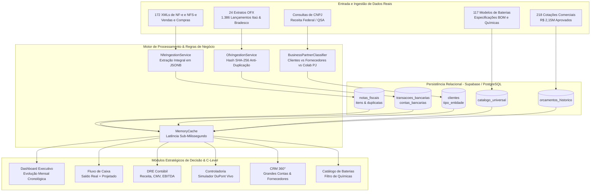
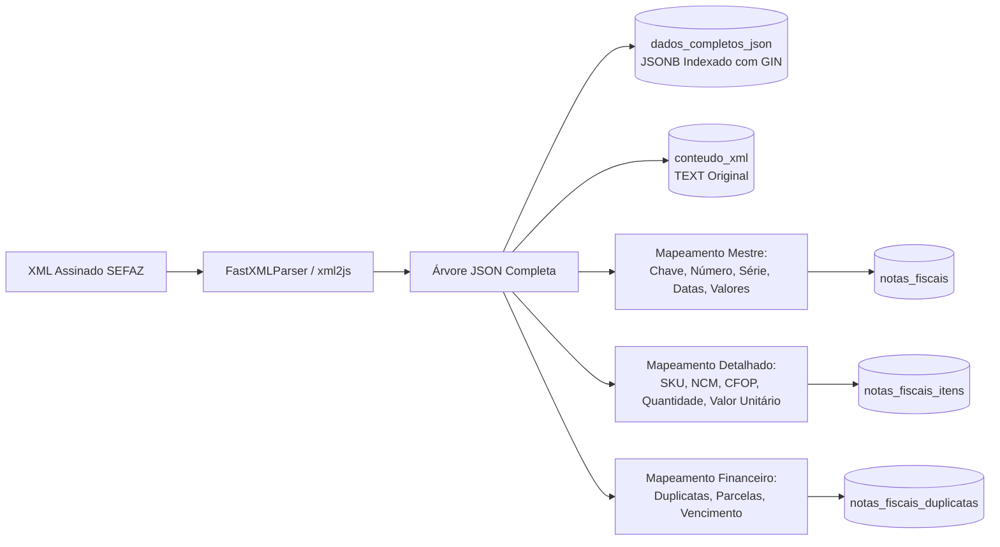
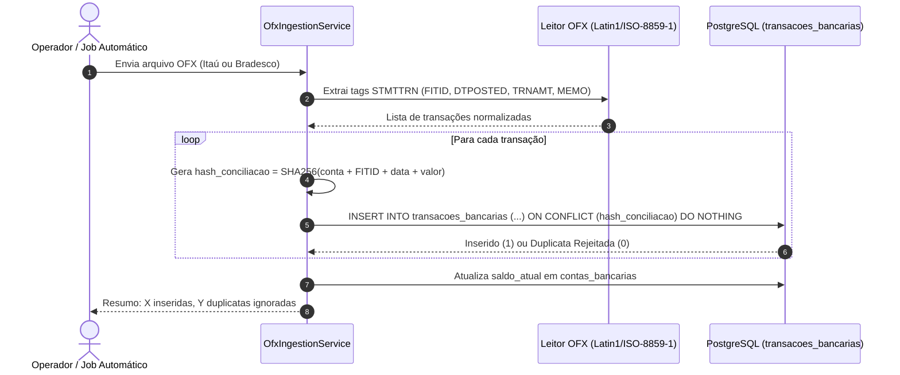
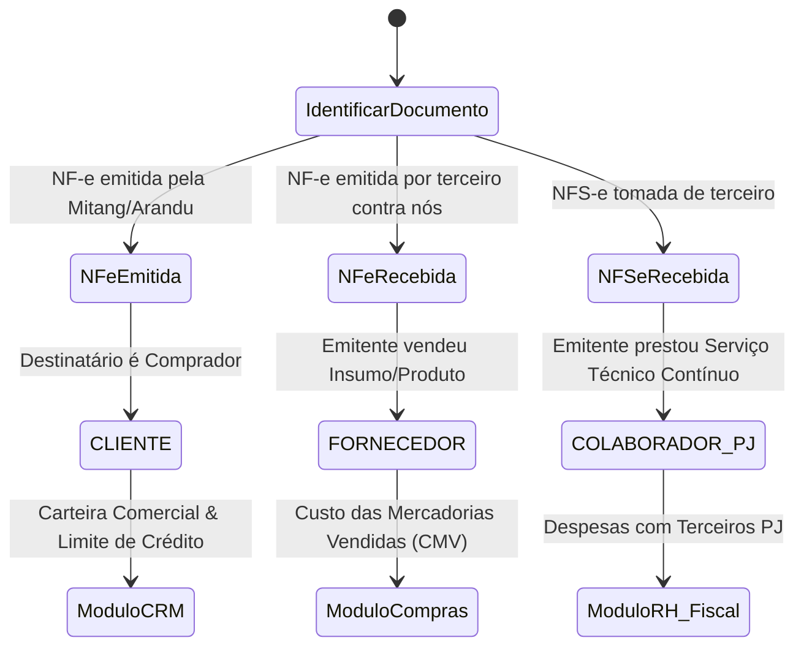
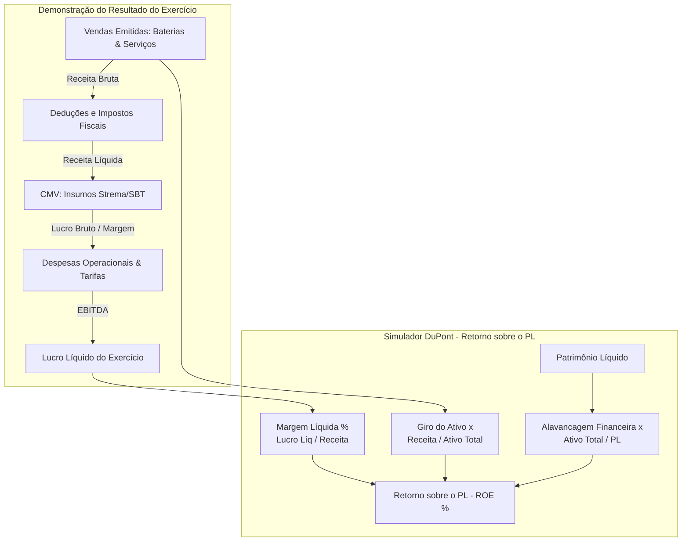
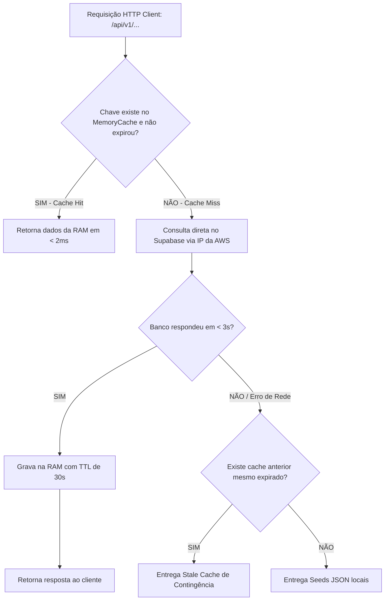

# Arquitetura e Fluxo de Trabalho do Sistema (Eco-Mitang ERP)

> **Documento Mestre para Desenvolvedores e Agentes de Inteligência Artificial (Antigravity, Cursor, Claude, OpenAI, Gemini)**  
> **Última Atualização:** 27 de Agosto de 2026  
> **Status:** Em Produção / Carga 100% Real Ativa  

---

## 1. Visão Geral da Holding Eco-Mitang

O ERP Eco-Mitang é uma plataforma empresarial multi-tenant desenvolvida para atender às demandas de engenharia, manufatura e operações submarinas da holding composta por 4 CNPJs:

1. **Mitang Brasil Comércio e Serviços LTDA** (CNPJ `44.221.348/0001-84`):
   - Especializada na engenharia e fornecimento de packs de baterias de alta densidade (Li-SOCL2, Alcalina, Ni-MH, Li-Ion) para equipamentos oceanográficos, robótica submarina (ROVs/AUVs) e área hospitalar.
2. **Arandu Comércio e Serviços LTDA** (CNPJ `61.349.982/0001-16`):
   - Braço comercial e técnico de baterias, soluções de energia e contratos corporativos offshore.
3. **Mitang Rental** (Locação e Metrologia DimCon):
   - Locação de transponders acústicos, medidores de corrente ADCP e sistemas de metrologia dimensional subsea.
4. **Mitang Academy** (Treinamentos Marítimos):
   - Capacitação técnica e cursos de operações offshore.

---

## 2. Diagramas de Fluxo de Trabalho (Workflows Mermaid)

### 2.1. Fluxograma Global do Ecossistema Integrado

O diagrama abaixo ilustra como os dados reais fluem entre os módulos do ERP:

---

### 2.2. Fluxo do Motor Fiscal Sem Perdas (NF-e & NFS-e)

Garante que nenhuma tag de imposto, item ou fatura seja descartada durante o processamento de notas:

---

### 2.3. Fluxo de Conciliação Bancária OFX com Idempotência Absoluta

Previne que arquivos bancários importados repetidamente gerem lançamentos duplicados:

---

### 2.4. Classificação Rigorosa de Parceiros de Negócio

Separação obrigatória para evitar contabilidade distorcida:

---

### 2.5. Arquitetura da DRE e Modelo de Análise DuPont

Demonstra a relação de causa e efeito entre vendas, compras de insumos e retorno ao acionista:

---

### 2.6. Camada de Cache em Memória com Fallback Instantâneo

Como a arquitetura alcança latência de **1.0ms a 4ms**:

---

## 3. Guia de Continuidade para Novas Ferramentas de IA e Desenvolvedores

Ao assumir o desenvolvimento deste repositório em qualquer IDE ou agente:

1. **Regras de Negócio Multi-Tenant**:
   - Sempre utilize o cabeçalho `x-empresa-id` nas chamadas de API.
   - Quando o valor for `all`, agregue as informações para consolidado da holding.
   - IDs Oficiais:
     * **Mitang Brasil**: `29ea0857-7cf7-44e1-ba36-a3f323c4670c`
     * **Arandu**: `0754c882-d528-4d34-8c96-6d9af7e8d322`
2. **Parceiros de Negócio**:
   - Ao criar novos endpoints de clientes, sempre filtre ou identifique `tipo_entidade` (`CLIENTE`, `FORNECEDOR`, `COLABORADOR_PJ`). Nunca misture na contagem de carteira.
3. **Catálogo de Baterias**:
   - Os modelos únicos de baterias somam 117 itens no catálogo base. Ao paginar, utilize limites de até 500 itens (`limit=500`).
4. **Performance**:
   - Utilize a classe `memoryCache` localizada em `src/core/cache/memory-cache.ts` para qualquer novo endpoint de leitura intensiva.
5. **Design System**:
   - Mantenha o padrão de **abas segmentadas** ("menos é mais") com a função global `window.switchTab(moduleName, tabId)`.
   - Evite acumular gráficos ou tabelas pesadas sem segmentação por abas na mesma viewport.
