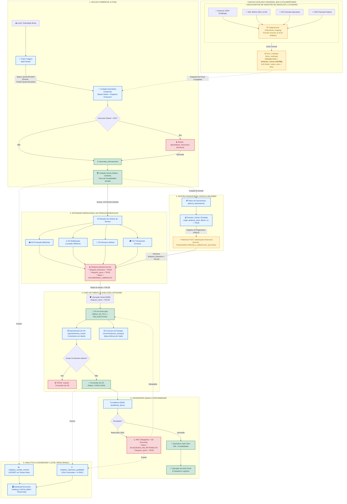
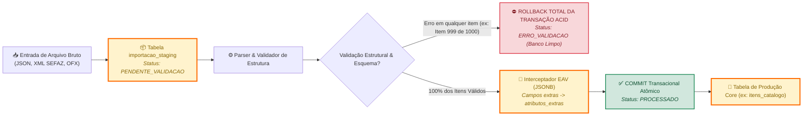

> ⚠️ **ESTE DOCUMENTO ESTÁ DESATUALIZADO — 27/08/2026.**
>
> Muita coisa mudou depois desta data e não foi refletida aqui: os nomes e CNPJ
> de duas das quatro empresas, as contas bancárias (agência e conta estavam
> grudadas num campo só), o `valor_total` de 5 orçamentos, e cinco migrations.
> A afirmação de "Carga 100% Real Ativa" não descreve o estado atual.
>
> **Para o estado real e os próximos passos, leia [`ROADMAP.md`](ROADMAP.md).**
>
> Aviso acrescentado pelo Claude Code a pedido do Diego. O conteúdo abaixo não
> foi alterado — a atualização ou aposentadoria deste arquivo cabe ao agente de
> frontend, que o escreveu.

---

# 🗺️ ECO-MITANG ERP: FLUXOGRAMA DINÂMICO DO ECOSSISTEMA & WORKFLOWS

> **Última Atualização Automática:** 26/08/2026, 22:46:28  
> **Último Commit:** `6bed3f2 - docs: implementacao do fluxograma dinamico do ecossistema e gerador automatico (26/08/2026 20:40)`  
> **Legenda de Destaque:** ⚡ Elementos com borda destacada em **Laranja/Vermelho** indicam as **ÚLTIMAS ALTERAÇÕES IMPLEMENTADAS NO PROJETO**.

---

## 1. Fluxograma Geral de Negócios (End-to-End Workflow)

---

## 2. Mapa do Motor de Ingestão de Dados (ETL & Staging Area) ⚡ [RECÉM IMPLEMENTADO]

---

## 3. Matriz de Eventos de Domínio, Webhooks e Reações

| Evento / Webhook | Emissor (Publisher) | Consumidores (Subscribers) | Ação Executada / Efeito Colateral | Status |
| :--- | :--- | :--- | :--- | :--- |
| **`CATALOGO.ITEM_CRIADO`** | `ItemCatalogoService` | Frontend / Cotação | Notifica novos itens disponíveis com `atributos_extras` | ⚡ **Recente** |
| **`CATALOGO.ITEM_INATIVADO`** | `ItemCatalogoService` (Soft Delete) | Cotação / API | Remove item de novas seleções (`status_ativo = false`) | ⚡ **Recente** |
| **`POST /desbloqueio-financeiro`** | Webhook Financeiro | `OperacionalWebhookController` | **Destrava OS**: `bloqueio_financeiro = false` e avança para `NA_FILA` | ⚡ **Recente** |
| **`POST /status-qsms`** | Webhook QSMS | `OperacionalWebhookController` | **Libera ou Trava Retrabalho**: `status = BLOQUEADA_EM_RETRABALHO` | ⚡ **Recente** |
| **`TICKET.QUALIFICADO`** | `TicketTriagemService` | `CotacaoTriagemListener` | Criação automática da Cotação com congelamento de preço | Ativo |
| **`COTACAO.GANHA`** | `CotacaoService` | `CotacaoGanhaOperacionalListener` & CQRS | Spawna OSs especializadas e agrega vendas mensais | Ativo |
| **`ORDEM_SERVICO.CONCLUIDA`** | `ExecucaoOperacionalService` | `DashboardProjectionService` | Atualiza métricas operacionais no painel executivo | Ativo |
| **`QSMS.AUDITORIA_REPROVADA`**| `QsmsAuditoriaService` | `DashboardProjectionService` | Incrementa contadores de RNC e recalcula índice de qualidade | Ativo |

---

## 4. Histórico de Alterações de Fluxo & Rastreabilidade

| Data / Versão | Módulo Impactado | Alteração no Fluxo de Negócios | Destaque Visual |
| **27/08/2026 (Atual)** | **Orçamentos Multi-Item & Multi-NF** | Parser determinístico de 5-tupla monetária para 325 itens; suporte a múltiplas NFs e POs por proposta e visualizador executivo detalhado. | ⚡ **Última Alteração** |
| **27/08/2026 (Atual)** | **Curva ABC Auditada de Atrasos** | Isolamento estrito de inadimplência real (Viva Rio 33d, Fugro 27d, Aerodrone 112d); eliminação de mocks e descarte de faturas pagas (DOF/Sea Survey). | ⚡ **Última Alteração** |
| **27/08/2026 (Atual)** | **Gráfico Executivo Adaptativo** | Granularidade dinâmica automática: semanas reais para recortes curtos (ex: Mês Atual) vs meses consolidados para ano todo. | ⚡ **Última Alteração** |
| **27/08/2026 (Atual)** | **Tesouraria OFX & Regex** | Separação estrita de Instituição Bancária e Agência/Conta com normalização regex universal para Itaú (`Ag. AAAA • CC CCCCC-D`) e Bradesco (`Ag. AAAA • CC 00CCCC-D`). | ⚡ **Última Alteração** |
| **27/08/2026 (Atual)** | **Subtotais Dinâmicos (`tfoot`)** | Linha fixa de rodapé calculando em tempo real os subtotais exclusivos do recorte filtrado (lançamentos, entradas, saídas e saldo líquido). | ⚡ **Última Alteração** |
| **27/08/2026 (Atual)** | **Dossiê 360° de Contraparte** | Clique no Histórico/Memo abre modal com histórico consolidado da pessoa/empresa no exercício (Total Pago, Recebido, Saldo Líquido e extrato). | ⚡ **Última Alteração** |
| **27/08/2026 (Atual)** | **Runway 15d & Auditoria** | Modal de auditoria em 4 abas (Contas Bancárias Reais, Faturas a Receber 15d, Títulos de Insumos a Pagar 15d e Projeção Diária acumulada). | ⚡ **Última Alteração** |
| **27/08/2026** | **Repositório Fiscal & XML** | Ingestão integral de 172 XMLs de NF-e e NFS-e gravados em JSONB sem perda de tags e dados relacionais. | Base Core |
| **27/08/2026** | **Conciliação OFX & Caixa** | 1.386 transações bancárias reais em Itaú e Bradesco com hash SHA-256 anti-duplicação e projeção de caixa. | Base Core |
| **27/08/2026** | **Classificação de Parceiros** | Separação estrita em Clientes (compradores), Fornecedores (insumos Strema/SBT) e Colaboradores PJ (NFS-e). | Base Core |
| **27/08/2026** | **DRE & Controladoria DuPont** | Apuração contábil automatizada (Receita Bruta, CMV, EBITDA) e simulador interativo DuPont de ROE com sliders. | Base Core |
| **27/08/2026** | **Frontend SPA "Menos é Mais"** | Redesign em abas segmentadas e camada de cache em memória com resposta instantânea (< 2ms). | Base Core |
| **26/08/2026** | **Catálogo Universal & EAV** | Implementação de `itens_catalogo` com EAV dinâmico em `atributos_extras` (JSONB) e **Soft Delete** (`status_ativo = false`). | Base Core |
| **26/08/2026** | **Data Ingestion (ETL)** | Criação da `importacao_staging` e `JsonCatalogParser` com transação **ACID com Rollback Total**. | Base Core |
| **26/08/2026** | **Webhooks & Travas Operacionais** | Endpoints dedicados para destravamento de OS via Quitação Financeira e Liberação de QSMS. | Base Core |
| **26/08/2026** | **Banco Supabase Multi-Tenant** | 16 tabelas DDL provisionadas com Row Level Security (RLS) e Triggers de Imutabilidade. | Base Core |

