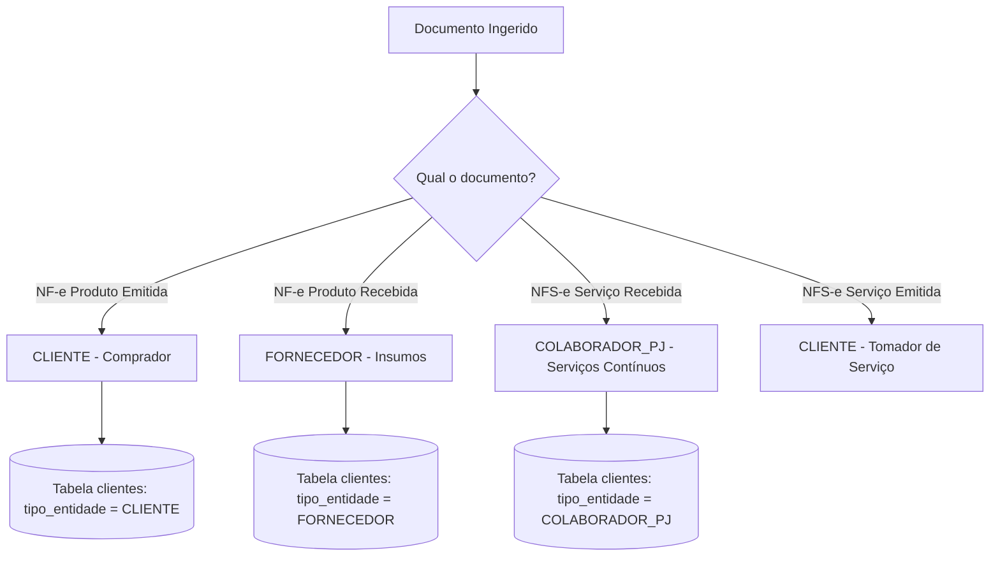

# Skill: Classificação de Parceiros de Negócio (Eco-Mitang)

## Descrição
Classificação estrita e sem ambiguidade de parceiros de negócio (Clientes vs Fornecedores vs Colaboradores PJ) na holding Eco-Mitang a partir de documentos fiscais eletrônicos (NF-e/NFS-e) e consultas públicas de CNPJ.

---

## 1. Classificação Tripartite

| Categoria | Descrição | Origem | Destino Contábil / Financeiro |
| :--- | :--- | :--- | :--- |
| **CLIENTE** | Compradores de baterias, locatários de equipamentos e tomadores de serviços subsea | Destinatário de NF-e emitida ou tomador de NFS-e emitida | Contas a Receber, Faturamento Bruto e Carteira CRM |
| **FORNECEDOR** | Vendedores de insumos industriais, células de lítio, cases, embalagens e componentes | Emitente de NF-e de produtos recebida (ex: Strema, SBT, Hayamax, Ryndack) | Custo das Mercadorias Vendidas (CMV) e Contas a Pagar |
| **COLABORADOR PJ** | Prestadores de serviços técnicos contínuos, engenharia, consultoria e assessoria | Emitente de NFS-e de serviços recebida (ex: Sea Survey, peritos) | Despesas Operacionais com Terceiros e Contas a Pagar |

---

## 2. Fluxograma de Tomada de Decisão

---

## 3. Boas Práticas para IAs
- **Nunca somar fornecedores na contagem de clientes**: Clientes ativos devem contar apenas entidades do tipo `CLIENTE`.
- **Manter vínculo multi-tenant**: Parceiros podem ser compartilhados entre empresas da holding, mantendo histórico de movimentação isolado por `empresa_id`.
