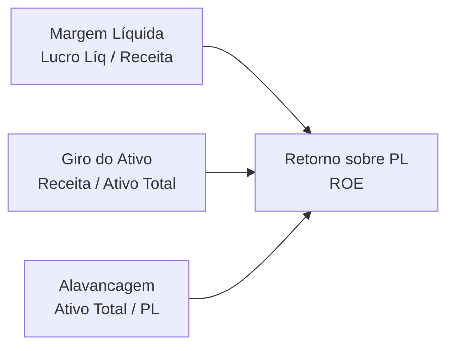

# Skill: Controladoria, DRE & Engenharia Financeira (Eco-Mitang)

## Descrição
Modelagem contábil e de controladoria para apuração da Demonstração do Resultado do Exercício (DRE), conciliação de fluxo de caixa em tempo real e simulação de retorno DuPont.

---

## 1. Fluxograma da DRE Contábil Dinâmica

```mermaid
flowchart TD
    VendasEmitidas[NF-e e NFS-e Emitidas] --> RB[Receita Operacional Bruta]
    RB --> Ded[(-) Deduções & Impostos sobre Vendas]
    Ded --> ROL[(=) Receita Operacional Líquida]
    
    ComprasInsumos[NF-e Insumos Recebidas: Strema/SBT] --> CMV[(-) Custo das Mercadorias Vendidas - CMV]
    ROL --> LB[(=) Lucro Bruto / Margem de Contribuição]
    CMV --> LB
    
    ServicosPJ[NFS-e Tomadas: Terceiros/PJ] --> DespOp[(-) Despesas Operacionais]
    ExtratosOFX[Tarifas & Encargos Bancários OFX] --> DespOp
    LB --> EBITDA[(=) EBITDA / Resultado Operacional]
    DespOp --> EBITDA
    
    EBITDA --> LL[(=) Lucro Líquido do Exercício]
```

---

## 2. Modelo de Análise DuPont

$$\text{ROE} = \text{Margem Líquida} \times \text{Giro do Ativo} \times \text{Alavancagem Financeira}$$



- **Margem Líquida**: Eficiência na conversão de faturamento em lucro líquido após insumos e despesas.
- **Giro do Ativo**: Intensidade e velocidade de vendas sobre o capital imobilizado e estoque de baterias.
- **Alavancagem Financeira**: Multiplicador de capital próprio vs capital de terceiros.
